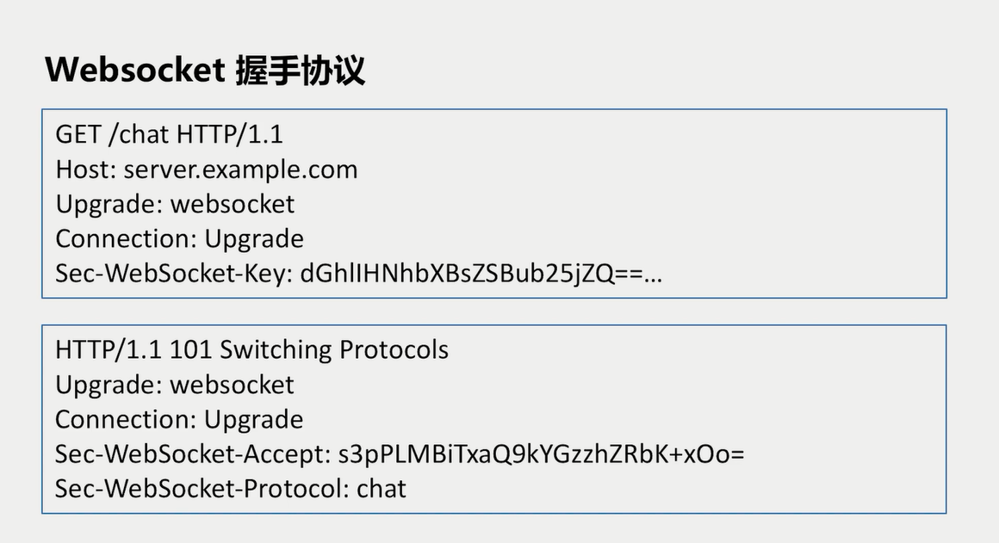

> Microservices study notes
>
> create by Mrchenhx 04/30/2022

#  计算机网络

## 1. OSI 七层网络协议


OSI 模型（开放系统互连网络模型）定义了互连的七层框架，即图中显示的结构

TCP/IP 模型借鉴了 OSI 模型。OSI 现有模型再有协议，而 TCP 先有协议再有模型。

OSI 模型是理论上的模型，而 TCP 是广泛使用的标准。

## 2. 经典协议与数据包

### TCP 协议


TCP 段是抓包工具常用分析的层级，即三次握手挥手分析的层级。

### HTTP 协议


###  Websocket 协议



底层是使用 HTTP 协议


### TCP 篇

#### TCP 握手与挥手分析


三次连接示意图：


四次挥手示意图：


为什么 time_wait 需要等待 2MSL？


为什么会出现大量 close_wait ？


样例关键代码：

```go

```

#### TCP - 流量控制


简易示意图：


#### TCP - 拥塞控制


拥塞控制分为：慢开始和拥塞避免、快速重传和快速恢复

##### 慢开始和拥塞避免


##### 快重传和快恢复


##### 粘包/拆包


#### 出现的原因：


##### 解决方案


## 3. 网络代理

### 什么是网络代理


### 网络代理与网络转发的区别

#### 网络转发


#### 网络代理


#### 实际区别


### 网络代理类型


### 正向代理


#### 实现 Web 浏览器代理


### 反向代理